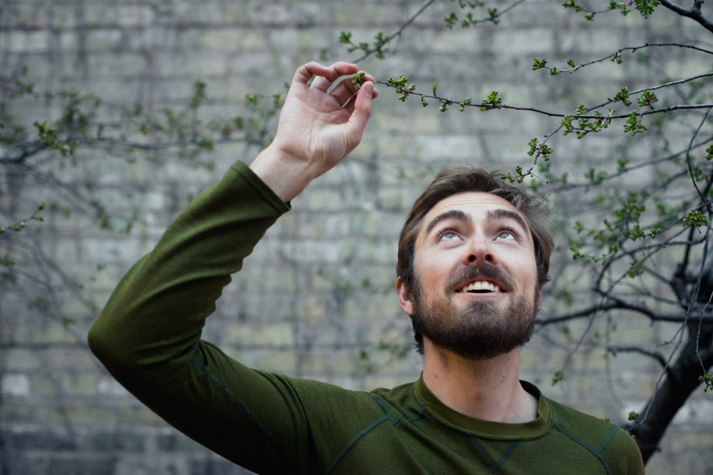

<!-- ## me -->

I'm a thinker, a dreamer, and a generalist. I am fascinated by how the world works and have fun imagining what it could become. This is my personal site, so expect ramblings on my favorite topics: regenerative agriculture, transit, land use, urban development, and code.

## whoami? professionally

I'm a friendly, social, and energetic individual, experienced software developer, and novice designer. I'm a dedicated teammate and servant leader. I have a passion for detangling complex systems, connecting disparate disciplines, and tackling mammoth challenges. I'm determined to learn, adapt, and use my knowledge and skill set as a force for good in the world.

Friendly, social, and energetic individual, experienced software developer, and novice designer. A dedicated teammate and servant leader. Passion for detangling complex systems, connecting disparate disciplines, and tackling mammoth challenges. Determined to learn, adapt, and use my knowledge and skill set as a force for good in the world.

[See my recent projects](/projects)

