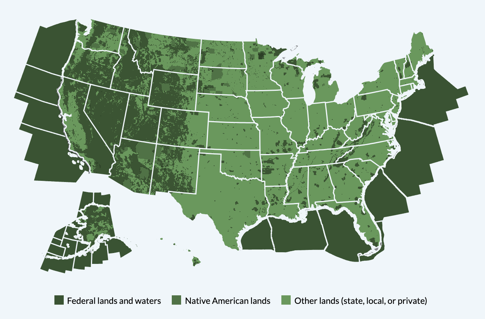

**[18F](https://18f.gsa.gov/) | 2015-17 | _Remote_**

## 18F
18F is a digital consultancy within the federal government. The group designs, builds and maintains prominent government websites and applications.

## [US EITI](https://revenuedata.doi.gov)

The Extractives Industry Transparency Initiative (EITI) is a global standard that promotes open and accountable management of natural resources. We worked with  Deloitte and the Department of the Interior (DoI), the U.S. agency that manages public federal lands and administers “extractive” leases (such as oil, gas, and mining), to develop a web version of America’s first EITI report.

In 2017, the US withdrew from EITI, but the site is maintained by a team at DoI.

_Source: [revenuedata.doi.gov](https://revenuedata.doi.gov)_

### My Role

I was one of two developers on this project. While I was responsible for a significant amount of the codebase, my role was broad, and included communicating with agency partners at Deloitte and DoI, data exploration and management, and map and chart design.

### Tools Used
JavaScript, Node.js, D3.js, Custom elements, Jekyll, SQL, Federalist, webpack, Fractal, User-centered design, Open-source engagement