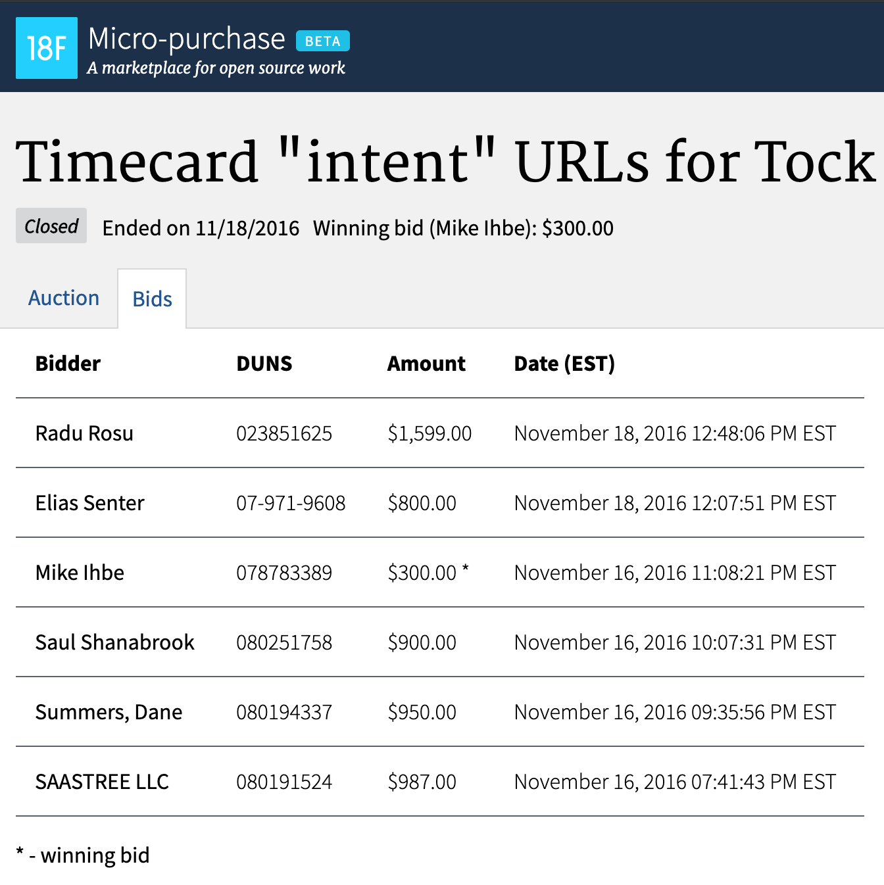

# Micro-purchase
**[18F](https://18f.gsa.gov/) | 2016 | _Remote_**

## 18F
18F is a digital consultancy within the federal government. The group designs, builds and maintains prominent government websites and applications.

## [Micro-purchase](https://micropurchase.18f.gov)

Micro-purchase was an experimental bug-bounty marketplace for 18F and USDS GitHub issues. The goal of the marketplace was to reduce barriers to entry for contract work on government projects. Anyone in the US could make bids on testable issues valued below $2,500.

_Source: [18f.gsa.gov](https://18f.gsa.gov)_

## My Role
I was one of three developers on this project, mostly involved in performing user research on our initial participants in the bug bounty marketplace.

## Tools Used
User Research, Ruby on Rails, Javascript, CSS, GitHub API
