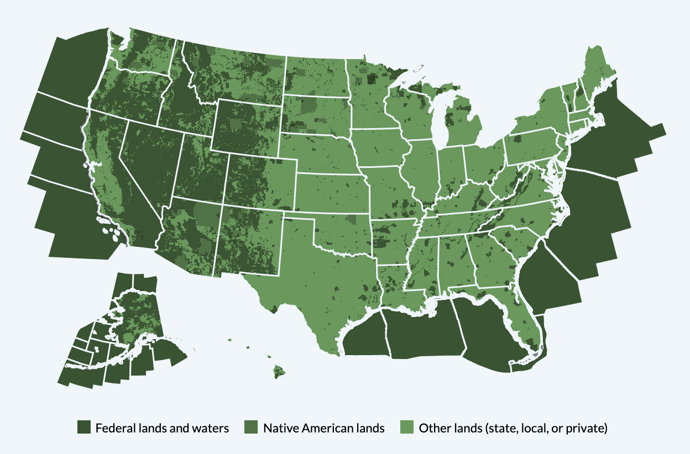
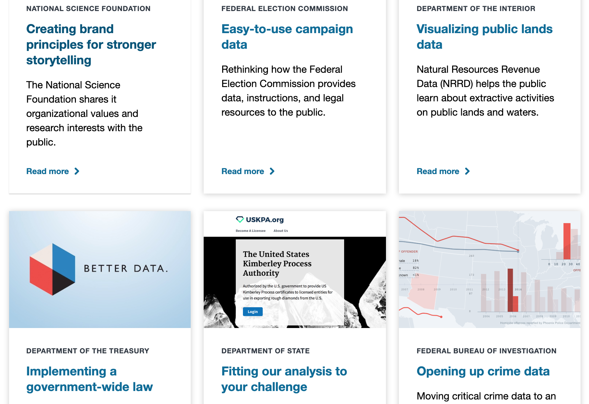

### Acro | [Sprowt Labs](https://www.sprowtlabs.com/) | 2017-19 | _Minneapolis, MN_
Co-Founded Sprowt Labs, an IoT company that designs and manufactures an internet-connected appliance for the craft brewing and craft distilling supply chains.

Architect and primary maintainer of our website and our web application. Major contributor to embedded firmware. Created methods for using our software enabled access point (SoftAP) as well as methods for updating system firmware.

_Source: [sprowtlabs.com](https://www.sprowtlabs.com)_

#### General Skills & Achievements:
* Product development for patented product that combines several bespoke mechanical functions (steeping, draining, aerating, humidifying, cooling, kilning)
* Product supply chain development for many of our 800+ parts
* Customer sales and technical support
* Won $29k grant for injection molding manufacturing
* Designed injection molded part and several other CAD-designed custom metal parts

#### Software & Firmware Tools Used:
Ruby on Rails, JavaScript, Various web APIs, Heroku, PostrgreSQL, Redis, Sidekiq, Web Sockets, AWS (S3, CloudFront), Particle API, C++, Arduino, Python, SoftAP

### [US EITI](https://revenuedata.doi.gov) | [18F](https://18f.gsa.gov/) | 2015-17 | _Remote_

One of two developers on the project. Other responsibilities included communication with agency partners, data exploration and management, as well as map and chart design.

_Source: [revenuedata.doi.gov](https://revenuedata.doi.gov)_

#### Tools Used:
* JavaScript, Node.js, D3.js, Custom elements, Jekyll, SQL, Federalist, webpack, Fractal, User-centered design, Open-source engagement

### [Login.gov](https://login.gov) | [18F](https://18f.gsa.gov/) | 2017 | _Remote_
Wrote Rails code for the security application (secure.login.gov) and Jekyll for the front-facing site ([www.login.gov](https://www.login.gov)). Implemented a style guide that enforced a unified style across multiple codebases.

_Source: [login.gov](https://www.login.gov)_

#### Tools Used:
Ruby on Rails, Jekyll, Fractal, Bass CSS

### [NSF SBIR](https://seedfund.nsf.gov) | [18F](https://18f.gsa.gov/) | 2017 | _Remote_

Served as a technical advisor on the project. Built a durable site that could be maintained with limited resources and technical acumen. Helped train NSF’s staff using GitHub wikis and webcasts.

_Source: [seedfund.nsf.gov](https://seedfund.nsf.gov)_

#### Tools Used:
Jekyll, Ruby, GitHub

### [18F Homepage](https://18f.gsa.gov) | [18F](https://18f.gsa.gov/) | 2016 | _Remote_

Helped conduct user research.

_Source: [18f.gsa.gov](https://18f.gsa.gov)_

#### Tools Used:
Jekyll, Ruby, User-centered design, JavaScript, Retext.js natural language processor

### Dolores Landingham Onboarding Bot | [18F](https://18f.gsa.gov/) | 2015 | _Remote_

Ruby on Rails, Slack API

### Digital Weekly Ad | [Target Corporation](digitalweeklyad.target.com/) | 2015 | _Minneapolis, MN_

Front-End lead on the migration of Target’s digital weekly ad (digitalweeklyad.target.com) from Ruby on Rails to a Node.js/AngularJS architecture. The ad was high profile, with considerable traffic, and revenues of ~$20M/month.

#### Tools Used:
Node.js, Express.js Angular.js, MongoDB, CSS, Ruby on Rails
