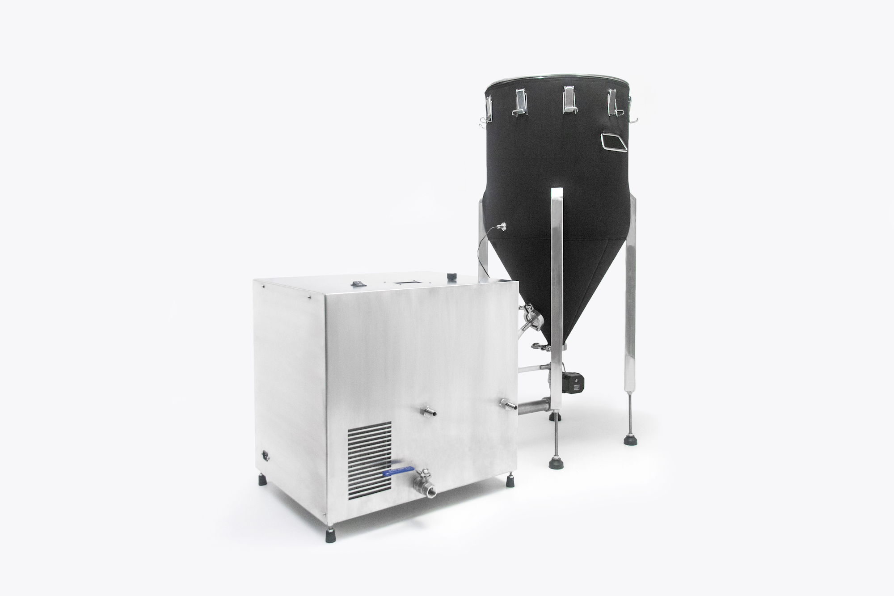

**[Sprowt Labs](https://www.sprowtlabs.com/) | 2017-Current | _Minneapolis, MN_**

## Sprowt Labs

Sprowt Labs is an IoT company that designs and manufactures an internet-connected appliance for the craft brewing and craft distilling supply chains.

_Source: [sprowtlabs.com](https://www.sprowtlabs.com)_

## My Roles
Co-Founder, Co-Owner, Software Lead. As one of two primary participants in the development of the company and our flagship product, Acro, I have been a major contributor in sales and customer relations, supply chain development, and the primary designer for all of our custom CAD parts.

I am the architect and sole maintainer of our website and our web application, as well as a major contributor to the appliance’s embedded firmware. I designed the WiFi setup flow for the software enabled access point (SoftAP).

### General Skills & Achievements
* Product development for patented product that combines several bespoke mechanical functions (steeping, draining, aerating, humidifying, cooling, kilning)
* Product supply chain development for many of our 800+ parts
* Customer sales and technical support
* Won $29k grant for injection molding manufacturing
* Designed injection molded part and several other CAD-designed custom metal parts

_Source: [sprowtlabs.com](https://www.sprowtlabs.com)_, exploded view of injection molded part that I designed.

### Software & Firmware Tools Used
Ruby on Rails, JavaScript, Various web APIs, Heroku, PostrgreSQL, Redis, Sidekiq, Web Sockets, AWS (S3, CloudFront), Particle API, C++, Arduino, Python, SoftAP
