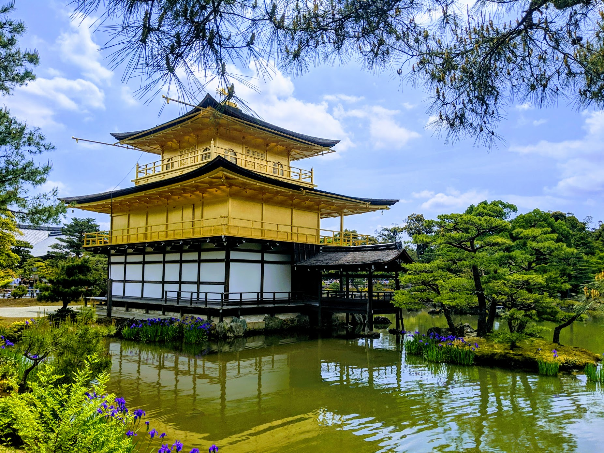
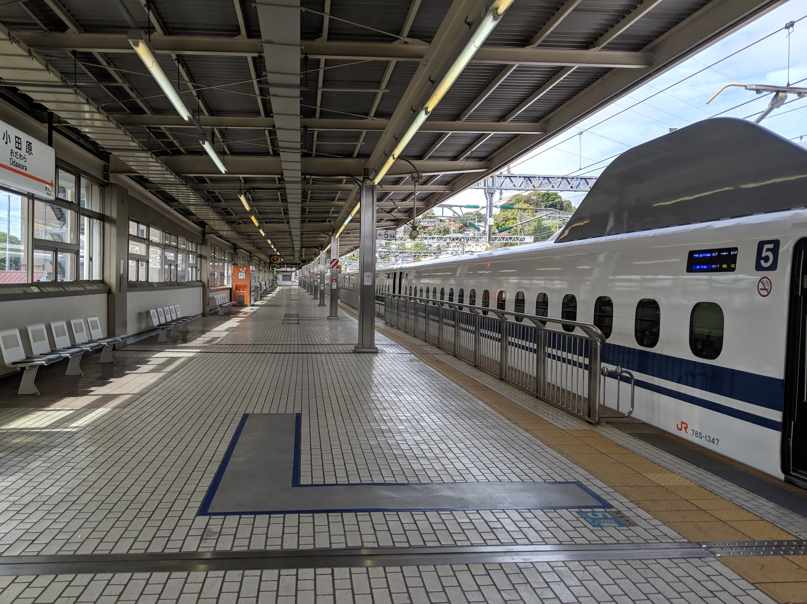
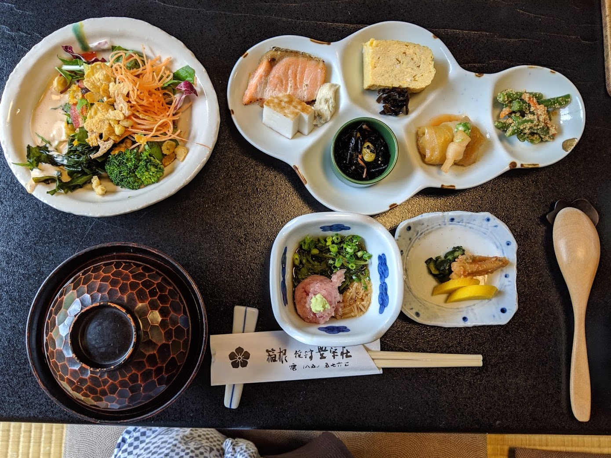
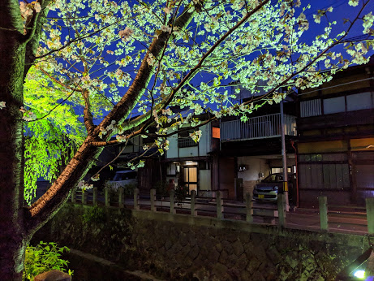
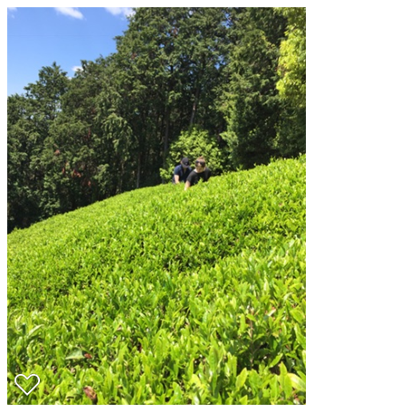

_Photo: Swathi Mummini_

I've been back from Japan for a few weeks, so I've had time to readjust and reflect on my time there.

### The land of 1000 7Elevens

One thing that came out of den

### Awesome transit
The transit there is amazing. Fast and timely trains are everywhere, even small, remote towns. Tourists are able to buy a JR pass for ~$400, an amazing value. Most Shinkansen (bullet train) tickets are ~$100-300, so if you leave Tokyo, it probably makes sense to get a JR pass.

_Photo: Swathi Mummini_, probably the only empty Shinkansen platform in Japan

### Delicous Food

_Photo: Swathi Mummini_, meal in Hakone

### Beautiful Scenery

_Photo: Swathi Mummini_, river walk in Takayama

_Photo: Swathi Mummini_, tea fields outside of Nara

### Density
Japan is uber dense, especially the eastern coast of Honshu. Because Japan is so mountainous, urban areas are quite dense. Even some of the more rural tea-growing areas that we visited felt like american suburbs, but with rice paddys or rows of tea instead of grass lawns.

I hate for this to be one of my main takeaways from visiting Japan, because I knew this going into the trip (see Wiki stats below), but it is hard to ignore. Being in such a dense place was invigorating and fun – transit was everywhere, food was everywhere, and it led to some pretty cool sightseeing.

#### Density stats
For perspective, the Tokyo metro area is similar in population to the state of California, with a fraction of the population.

_California:_
* Population:	39,557,045 [source](https://en.wikipedia.org/wiki/California#Population)
* Land area: 163,696 sq mi (423,970 km2)
* Population Density:	**240/sq mi (92.6/km2)**

_Metro Tokyo:_
* Population:	38,140,000 [source](https://en.wikipedia.org/wiki/Tokyo)
* Land area: 5,240 sq mi (13,572 km2)
* Population Density:	**6,890/sq mi) (2,662/km2)**

**So Tokyo is ~28.7x more dense than California.**

Honshu, Japan's largest island, and home to Tokyo, Osaka, Kyoto, and others has the same population as the four most populous states combined California, Texas, Florida, and New York in an area slightly smaller than Texas.

_Honshu:_
* Population:	104,000,000 [source](https://en.wikipedia.org/wiki/Honshu)
* Land area: 88,020 sq mi (227,960 km2)
* Population Density:	**1,158 /sq mi) (447 /km2)**

**Honshu is 4.8x more dense than California.**

When you compare the largest cities, it is even more crazy. Tokyo Metro is ~3.7x as dense as New York Metro with roughly double the population.

_New York Metro:_
* Population:	20,320,876 [source](https://en.wikipedia.org/wiki/New_York_metropolitan_area#Metropolitan_Statistical_Area)
* Land area: 13,318 sq mi (34,490 km2)
* Population Density:	**1,781.3/sq mi (687.8/km2)**

_Metro Tokyo:_
* Population:	38,140,000 [source](https://en.wikipedia.org/wiki/Tokyo)
* Land area: 5,240 sq mi (13,572 km2)
* Population Density:	**6,890/sq mi) (2,662/km2)**

