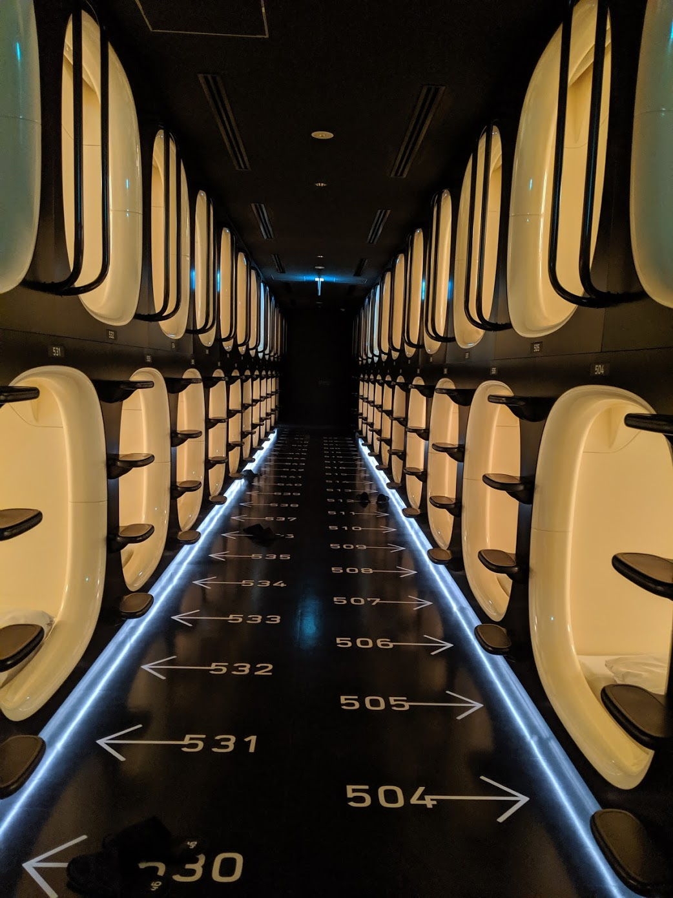
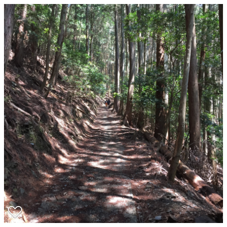

_Photo: Swathi Mummini_

I've been back from Japan for a few weeks, so I've had time to readjust and reflect on my time there.

### Density
Japan is uber dense, especially the eastern coast of Honshu. There are people basically anywhere there aren't mountains. Even some of the more rural tea-growing areas that we visited felt like american suburbs, but with rice paddys or rows of tea instead of grass lawns.

I hate for this to be one of my main takeaways from visiting Japan, because I knew this going into the trip (see Wiki stats below), but it is hard to ignore. Being in such a dense place was invigorating and fun – transit was everywhere, food was everywhere, and it led to some pretty cool sightseeing. For instance, we slept in a capsule hotel one night. It felt very futuristic, and for some reason I love it!

_Capsule hotel. Where you are just a number_

#### Density stats
For perspective, the Tokyo metro area is similar in population to the state of California, with a fraction of the population.

_California:_
* Population:	39,557,045 [source](https://en.wikipedia.org/wiki/California#Population)
* Land area: 163,696 sq mi (423,970 km2)
* Population Density:	**240/sq mi (92.6/km2)**

_Metro Tokyo:_
* Population:	38,140,000 [source](https://en.wikipedia.org/wiki/Tokyo)
* Land area: 5,240 sq mi (13,572 km2)
* Population Density:	**6,890/sq mi) (2,662/km2)**

**So Tokyo is ~28.7x more dense than California.**

Honshu, Japan's largest island, and home to Tokyo, Osaka, Kyoto, and others has the same population as the four most populous states combined California, Texas, Florida, and New York in an area slightly smaller than Texas.

_Honshu:_
* Population:	104,000,000 [source](https://en.wikipedia.org/wiki/Honshu)
* Land area: 88,020 sq mi (227,960 km2)
* Population Density:	**1,158 /sq mi) (447 /km2)**

**Honshu is 4.8x more dense than California.**

When you compare the largest cities, it is even more crazy. Tokyo Metro is ~3.7x as dense as New York Metro with roughly double the population.

_New York Metro:_
* Population:	20,320,876 [source](https://en.wikipedia.org/wiki/New_York_metropolitan_area#Metropolitan_Statistical_Area)
* Land area: 13,318 sq mi (34,490 km2)
* Population Density:	**1,781.3/sq mi (687.8/km2)**

_Metro Tokyo:_
* Population:	38,140,000 [source](https://en.wikipedia.org/wiki/Tokyo)
* Land area: 5,240 sq mi (13,572 km2)
* Population Density:	**6,890/sq mi) (2,662/km2)**

### The land of 1000 7 Elevens
We had heard going into the trip that the convenient stores (conbinis) in Japan were amazing. Articles like [this](https://www.eater.com/2017/2/21/14668440/tokyo-convenience-store-conbini-snacks) had made us eager to check them out – why were chefs and critics like David Chang and Anthony Bourdain in love with convenient store food?

I was skeptical, but I came around and left wondering why 7 Elevens aren't as lovely in the states.

#### Why are they so great??

1. **The food is quality and cheap.** The quality is really high for convenient stores. You can get a fairly healthy meal for under $3. If you spend a bit more you can get a bento box or larger meal.
1. **Easy for foreigners.** Transactions weren't always smooth for me in Japan. The conbini transactions were great for non-speakers. They are clean and consisistent.
1. **Variety.** Most conbinis had a fairly large selection of food for their size. They also had snacks, water, liquor, and a large selection of toiletry selections.
1. **They are everywhere.** How ever many you are imagining, there are twice that many. The big three conbinis (7 Eleven, Lawson, and FamilyMart) are on almost every block, often times much more frequently than that. I saw three 7 Elevens on one train platform in Kobe alone. And there were 3+ on the other side! Quantity isn't everything, but it was somehow conforting to know that I could get an egg salad sandwich whenever I wanted.

The rice triangles and egg salad sandwiches were my personal favorite.

The rice triangles were my go-to meal. For a little over $1 they were filling, tasty, and cheap. They were fun to eat and came in many different flavors, like tuna, salmon, sea weed, and pickled plum.

The egg salad sandwiches are like eating a cloud. The egg is smooth and creamy without much flavor. The bread is white and fluffy with the crusts cut off. Normally I wouldn't go for a sandwich like this, but the execution is perfect.

### Awesome transit
The transit there is amazing. Fast and timely trains are everywhere, even in small remote towns. Tourists are able to buy a JR pass for ~$400, an amazing value. Most Shinkansen (bullet train) tickets are ~$100-300, so if you leave Tokyo, it probably makes sense to get a JR pass.

_Photo: Swathi Mummini_, probably the only empty Shinkansen platform in Japan

I had heard rumors that the Tokyo metro hires people to cram people into subways and that bullet trains were severely cramped. This was complete bologna in my experience.

Riding the Shinkansen was fun, especially the first time, and made me wish that we could do something like this in the US. I'm assuming that the size of our country,  the strength of the car lobby, and the existing infrastructure in place for car and air travel will prevent us doing something like this soon, but a boy can dream!

### Delicous food

I was a bit overwhelmed by the food – it was so consistently good and affordable that I found myself overeating, something I'm generally pretty good about avoiding.

I can't say that I had one meal in particular that blew me away, but the food quality was consistently high, from the conbinis already mentioned to street vendors selling fried chicken. The craft of cooking is alive in Japan.

_Photo: Swathi Mummini_, meal in Hakone

### Beautiful parks and gardens

<!-- ADD MORE HERE -->

_Photo: Swathi Mummini_, river walk in Takayama

_Photo: Swathi Mummini_, tea fields outside of Nara

_Cedar groves outside of Nara_

_Photo: Swathi Mummini_, cherry blossoms

_Photo: Swathi Mummini_, torii on Miyajima Island, outside of Hiroshima

### Great friends

_The group harvesting tea leaves!_